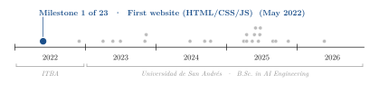
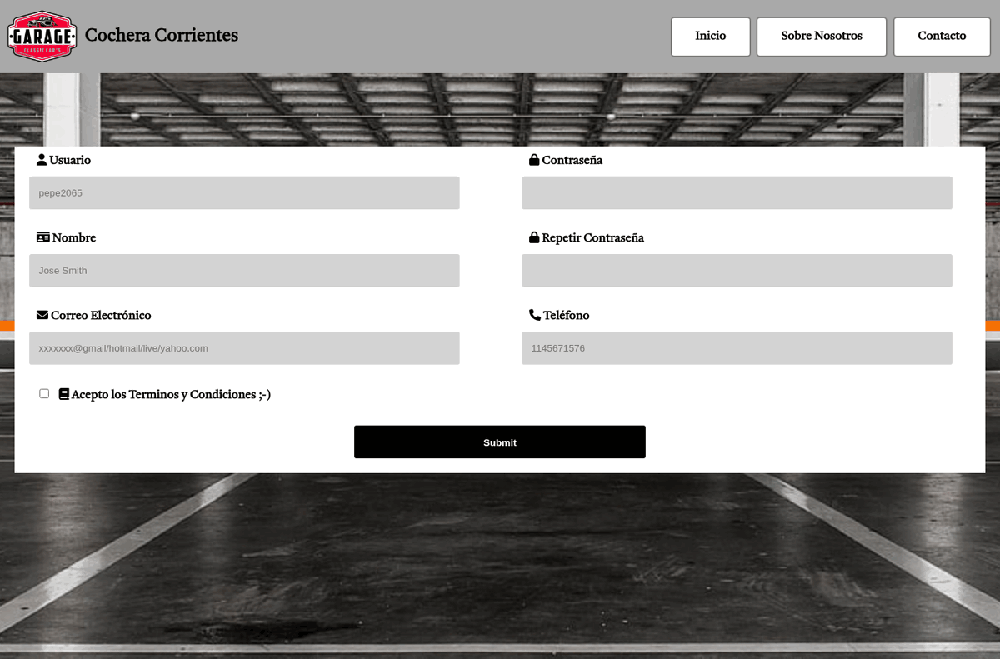
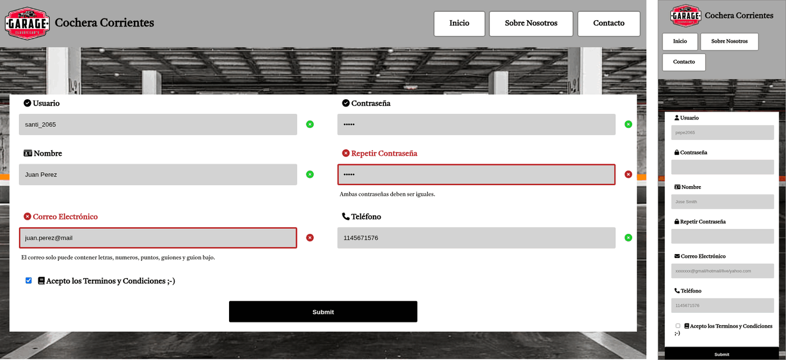

<div align="center">

# Cochera Corrientes: A Static Website for a Parking Garage

**Santiago Groba Alonso**

Self-taught personal project · First website · May 2022

[](#running-locally)
[](#running-locally)
[](#running-locally)

<picture>
  <source media="(prefers-color-scheme: dark)" srcset="docs/figures/trajectory-dark.svg">
  
</picture>

<p align="center"></p>

</div>

**Figure 1.** Home page rendered at 1366 × 900 px: header with logo and navigation, and the client registration form over a fixed full-screen background.

---

## Overview

A three-page static website for a parking garage in Buenos Aires ("Cochera Corrientes"), written by hand in plain HTML, CSS and JavaScript in May 2022. It was the first website I built, and it covers the basics in one small project: a shared header and navigation bar, a responsive layout with media queries, an embedded map, and a registration form with client-side validation written without a framework.

The "About us" page states the intent of the site: to let monthly customers manage the entry and exit of their vehicles online, and to publish past invoices and payment reminders. Only the front end was built; there is no back end, so the form never leaves the browser.

## Features

| Page | File | Content |
|---|---|---|
| Home | `index.html` | Customer registration form (user, password and confirmation, name, e-mail, phone, terms checkbox) |
| About us | `SobreNosotros.html` | Short description of the garage and of what the site is meant to offer |
| Contact | `Contacto.html` | Office address, phone and e-mail, plus an embedded OpenStreetMap iframe centred on the garage |

- **Live form validation** (`js/formulario.js`). Each field is checked on `keyup` and `blur` against a regular expression (user: 4–16 letters, digits, `-` or `_`; name: up to 40 letters with accents; password: 4–12 characters; phone: 7–14 digits; a simple e-mail pattern). The field group switches to a valid or invalid state, an error message appears under the input, and the "repeat password" field is compared with the first one. On submit, the form is reset and a success message is shown for 5 s only if every field and the terms checkbox are valid; otherwise an error banner is displayed.
- **Responsive layout** (`estilos.css`). The header is a flexbox row that stacks vertically below 700 px; the form is a two-column CSS grid that collapses to one column below 800 px.
- **Shared look.** One stylesheet for the three pages, a fixed `background-attachment` photo, the *Tiro Devanagari Marathi* web font and Font Awesome icons.

<p align="center"></p>

**Figure 2.** Left: validation state after typing into every field; the e-mail without a top-level domain and the mismatched password confirmation are flagged in red with their error messages. Right: the same page at 390 px width, where the navigation wraps and the form collapses to a single column.

## Architecture

```
index.html, SobreNosotros.html, Contacto.html
 ├── estilos.css            shared styles, background photo, media queries
 ├── img/                   logo and background
 ├── js/formulario.js       regex table + per-field validation state (index.html only)
 └── CDN                    Google Fonts, Font Awesome kit, OpenStreetMap embed (Contacto.html)
```

There is no build step and no dependency to install. A copy of Bootstrap 5.2.0-beta1 is vendored under `css/` and `js/`, but no page links to it; all styling is in `estilos.css`.

## Stack

HTML5 · CSS3 (flexbox, grid, media queries) · vanilla JavaScript (DOM events, regular expressions) · Google Fonts · Font Awesome · OpenStreetMap embed.

## Running locally

```bash
git clone https://github.com/Santi2065/Garage-Website.git
cd Garage-Website
xdg-open index.html        # or: python3 -m http.server, then open http://localhost:8000
```

The fonts, icons and map are loaded from their CDNs, so they need an internet connection. The screenshots in this README were taken with headless Chrome (`google-chrome --headless --screenshot --window-size=1366,900 index.html`); the validation state in Figure 2 was produced by typing sample values into the form.

| File | Content |
|---|---|
| `index.html`, `SobreNosotros.html`, `Contacto.html` | The three pages |
| `estilos.css` | All the site's styles |
| `js/formulario.js` | Form validation logic |
| `img/` | Background photo and logo |
| `css/`, `js/bootstrap*` | Vendored Bootstrap 5.2.0-beta1 (unused) |
| `docs/figures/` | Screenshots used in this README |

## Project status

Finished as a learning exercise in May 2022 and not maintained. Known limitations, left as they were: there is no back end, so submitting the form does not store anything; the validation icons are toggled on the label icon rather than on the status icon at the right of each input; and the error message under "Nombre" repeats the text of the user-name rule.
